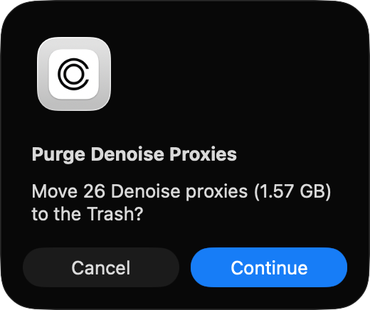
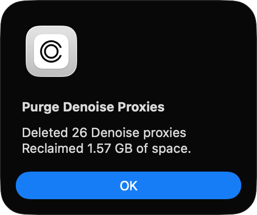

# Purge Denoise Proxies

**Donations**: if you like to keep these scripts free please consider [buying me a coffee](https://buymeacoffee.com/walterrowe).

## Description

Enhanced Denoise is a new feature provided by Capture One 16.8. When enabled Capture One creates "noise reduced" proxies of the original raw files. These proxies are stored in the same folder as image previews with a ".conoisereduced" extension. The format of the filename is the full camera original raw file name on disk plus this extension (e.g. "WPR-20260503-9437.NEF.conoisereduced"). These files are approximately the same size as the original raw file. Enabling this feature on large numbers of files will dramatically increase the amount of space required to store your catalog or session.

In my experimentation if these files are removed Capture One will regenerate them as needed much like normal previews. In order to minimize the impact on space required for this feature I wrote this utility to find and remove the noised reduced proxies. The utility purges these proxies by moving the to the System Trash.

When executed the script searches for all of the denoise proxies in the current document (session or catalog). You will be shown the number of proxies found and total space consumed, and then asked for confirmation to proceed.

If you proceed, then the proxies are moved to the System Trash and a confirmation is given when complete.

- If any variants are selected then only the selected variants denoise proxies are included and moved to Trash
- If no variants are selected then ALL denoise proxies that are found are included and moved to Trash

All of the "deleted" proxies are moved to the System Trash via Finder. You open the Trash and "Put Back" any proxies you wish. The space will not be truly reclaimed until you permanently delete the proxies from the System Trash.

**SUGGESTION**: Enable Enhanced Denoise only on your best images that truly benefit from it. Apply your adjustments and export all your finished work. Once you have delivered your work and no longer need to export from the raw files you can safely remove the noise reduced proxies until you need them again.

## Prerequisites

None

# Installation

The script self-installs in your Capture One Scripts folder.

1. Open the AppleScript file in macOS Script Editor.
1. Click the "Run this script" (&#9654;) button.
1. Open Capture One and choose Scripts > Update Script Menu.
1. You now can run the script from the Capture One Scripts menu.

## Compatibility

The utility has been tested on:

- macOS Tahoe (Apple M3 and M4 systems)
- Capture One 16.8

## ChangeLog

- 28 May 2026 - initial version
