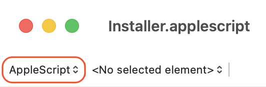

# App Name

**Donations**: if you like to keep these scripts free please consider [buying me a coffee](https://buymeacoffee.com/walterrowe).

## Description

## Prerequisites

## Installation

The script self-installs into your local Capture One Scripts folder on first run.

1. Open `Installer.applescript` (or `.scpt`) in macOS **Script Editor**.
2. Make sure that ScriptEditor shows "AppleScript" (**NOT JavaScript**).
    
    

3. Click the **Run** button (&#9654;). The script will automatically download and compile the required `COscriptlibrary` library into `~/Library/Scripts/Capture One Scripts/`.
4. Open Capture One and navigate to **Scripts > Update Script Menu**.
5. You can now execute **Relink Missing Files** directly from Capture One's **Scripts** menu.

## How To Use

## Compatibility

The utility has been tested on:

- macOS Sonoma (Intel and M3 MacBook Pro)
- Capture One 16.4

## ChangeLog

- DD Mon YYYY - initial version
